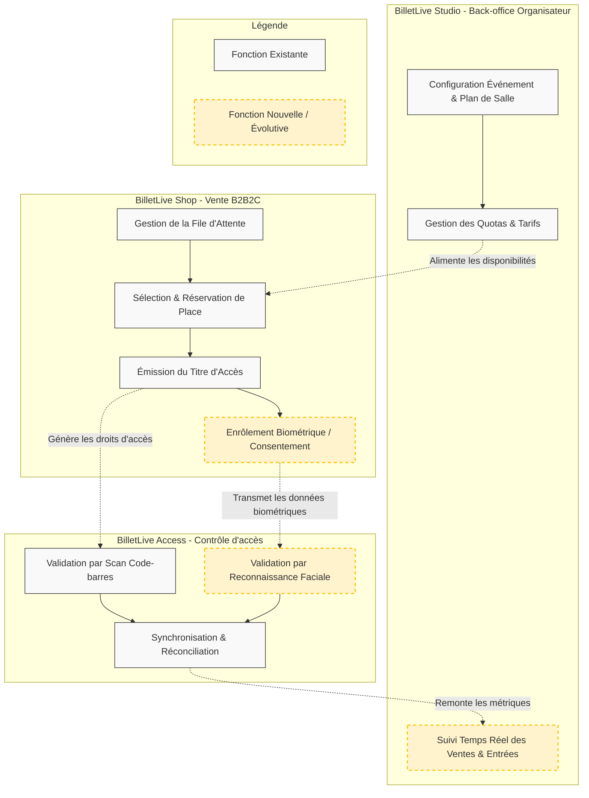

# 2. Vue métier

## 2.1 Fonctions métier principales

La cartographie ci-dessous représente l'enchaînement des fonctions métier couvertes par le périmètre principal de BilletLive (BilletLive Studio, BilletLive Shop et BilletLive Access).

Description des fonctions métier :

- Configuration Événement & Plan de Salle (Studio) : Permet à l'organisateur de définir la structure de son événement, de dessiner son plan de salle, et de préparer la mise en vente.
- Gestion des Quotas & Tarifs (Studio) : Consiste à allouer des volumes de places par catégories de prix et à piloter les jauges.
- Gestion de la File d'Attente (Shop) : Capacité cruciale à orchestrer l'arrivée massive d'acheteurs de manière équitable sans faire s'effondrer le système de réservation.
- Sélection & Réservation de Place (Shop) : Permet à un acheteur de choisir sa place et garantit son verrouillage temporaire strict (unicité) le temps de finaliser la commande.
- Émission du Titre d'Accès (Shop) : Génération du billet dématérialisé nominatif.
- Validation par Scan Code-barres (Access) : Contrôle des billets aux entrées de manière ultra-rapide, avec la capacité de fonctionner sans réseau internet continu.
- Synchronisation & Réconciliation (Access) : Collecte des données de scan pour empêcher la double-entrée, même si plusieurs portes de contrôle sont déconnectées temporairement, puis consolidation finale.

## 2.2 Acteurs du SI

Les acteurs interagissent de manière transverse avec les trois produits de l'écosystème analysé.

| Acteur                    | Interne / externe | Rôle                                                                                                                  | Fonctions métier utilisées                                                       |
| :------------------------ | :---------------- | :-------------------------------------------------------------------------------------------------------------------- | :------------------------------------------------------------------------------- |
| Organisateur              | Externe           | Client B2B de BilletLive. Il configure ses événements, gère ses jauges et consulte les statistiques de fréquentation. | Configuration Événement, Gestion des Quotas, Suivi Temps Réel (_Studio_)         |
| Spectateur / Acheteur     | Externe           | Utilisateur final B2C. Il affronte les pics de charge pour acheter une place, s'enregistre et se présente le jour J.  | File d'Attente, Réservation, Émission de billet, Enrôlement biométrique (_Shop_) |
| Agent de contrôle         | Externe           | Personnel ou bénévole mandaté par l'organisateur sur le lieu de l'événement pour vérifier les accès.                  | Validation par Scan (_Access_)                                                   |
| Support BilletLive        | Interne           | Assiste les organisateurs dans la configuration et surveille le bon déroulement des mises en vente.                   | _Toutes les fonctions (via accès super-administrateur sur Studio)_               |
| Équipe Produit BilletLive | Interne           | Développeurs (12) exploitant la plateforme au quotidien sans astreinte dédiée (DevOps).                               | _Exploitation transversale (Shop, Studio, Access)_                               |

## 2.3 Exigences

Les exigences sont classées par priorité et associées aux produits qu'elles impactent directement.

| ID     | Type              | Description                                                                                                                                | Priorité     | Produit(s) Impacté(s)              |
| :----- | :---------------- | :----------------------------------------------------------------------------------------------------------------------------------------- | :----------- | :--------------------------------- |
| EF-1   | Fonctionnelle     | File d'attente et unicité : Ordonner les acheteurs et garantir stricte impossibilité de survendre une place (même siège/même quota).       | 1 - Critique | BilletLive Shop                    |
| EF-2   | Fonctionnelle     | Contrôle dégradé : Valider un billet sans connectivité réseau sur le lieu de l'événement et réconcilier les accès _a posteriori_.          | 1 - Critique | BilletLive Access                  |
| ENF-1  | Non Fonctionnelle | Élasticité extrême : Absorber 40 000 requêtes/seconde en pointe (x200 vs nominal) en 3 minutes de manière automatisée.                     | 1 - Critique | BilletLive Shop                    |
| ENF-2  | Non Fonctionnelle | Performance de contrôle : Validation d'un titre d'accès en moins de 300 millisecondes au tourniquet.                                       | 1 - Critique | BilletLive Access                  |
| EF-3\* | Fonctionnelle     | Suivi Temps Réel : Les organisateurs doivent pouvoir suivre les ventes et les entrées pendant l'événement sans latence majeure.            | 2 - Haute    | BilletLive Studio                  |
| EF-4\* | Fonctionnelle     | Entrée Biométrique : Permettre l'enrôlement facial facultatif, le recueil du consentement et le franchissement sur reconnaissance faciale. | 2 - Haute    | BilletLive Shop, BilletLive Access |
| ENF-3  | Non Fonctionnelle | Opérabilité limitée : Maintenable par 12 développeurs sans astreinte 24/7 (privilégier l'infrastructure managée / serverless).             | 2 - Haute    | Tous (Shop, Studio, Access)        |
| ENF-4  | Non Fonctionnelle | Maîtrise des coûts : Le coût d'infrastructure doit être inférieur à 0,04 € par billet vendu et mesurable par organisateur.                 | 2 - Haute    | Tous (Shop, Studio, Access)        |

## 2.4 Impact de l'évolution sur les fonctions et les acteurs

L'ambition de BilletLive (développement international, grands stades, disparition du billet physique) modifie profondément l'écosystème :

1. L'avènement du "Sans Billet" (Reconnaissance Faciale) :

- Fonctions transformées : Sur le _Shop_, le tunnel de vente doit désormais intégrer un processus complexe d'enrôlement (capture de photo) et de gestion granulaire du consentement (RGPD). Sur _Access_, le métier passe d'une "lecture de document" (scan) à une "identification d'individu", nécessitant de s'interfacer avec des équipements lourds (caméras sur 40 tourniquets).
- Impact Acteurs : Le spectateur devient fournisseur de données biométriques. L'agent de contrôle perd une partie de son rôle manuel au profit de systèmes automatisés dans les stades.

2. Le passage à l'échelle des Grands Stades (60 000 places) :

- Fonctions transformées : La fonction "Synchronisation & Réconciliation" d'_Access_ subit une pression inédite (traiter 60 000 entrées en moins d'une heure de manière distribuée).

3. Le besoin d'instantanéité pour les organisateurs :

- Fonctions transformées : Le back-office _Studio_ passe d'un outil de configuration statique à un tableau de bord analytique ("Suivi Temps Réel"), imposant que les événements générés par le _Shop_ (ventes) et _Access_ (entrées) soient streamés et consolidés instantanément vers le _Studio_.
